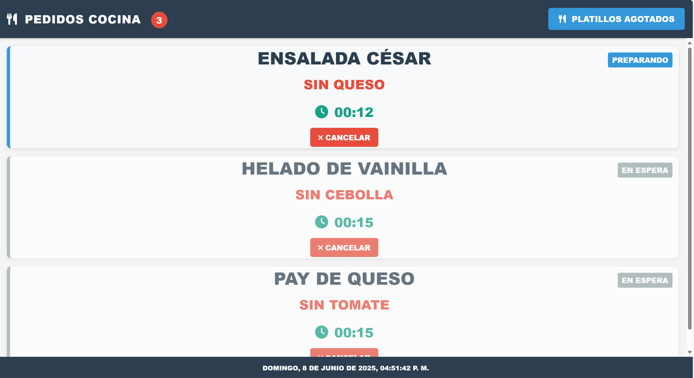

# 🍽️ Sistema de Pedidos para Cocina

## 📝 Descripción del proyecto
Este sistema web permite visualizar y gestionar los pedidos realizados por los clientes desde el área de cocina. Está diseñado para facilitar el control de tiempos, condiciones especiales y el estado de los platillos.

## ⚙️ Funcionalidades
- 📋 Visualización de pedidos activos por mesa.
- 🔄 Estado de pedido: pendiente, en preparación, terminado.
- ⏱️ Estimación visual de tiempo por platillo.
- ❌ Botón para cancelar o cambiar el estado del pedido.
- 🧾 Visualización de notas especiales (sin queso, sin cebolla, sin gluten, etc.).
- 📦 Botón de productos agotados para notificar al servicio.

## 👨‍🍳 ¿Cómo usarlo?
1. Abrir el sistema en un navegador desde la cocina.
2. Visualizar la lista de pedidos activos.
3. Revisar notas y tiempos asignados.
4. Actualizar el estado del pedido según corresponda.
5. Cancelar pedidos si es necesario.

## 📸 Capturas de pantalla
### Interfaz principal

> Muestra los pedidos en tiempo real con colores para los distintos estados y alertas visuales.
> Cada platillo muestra restricciones alimenticias, tiempo de preparación y botones de acción.
### Agotamiento de platillos

## 🛠️ Tecnologías utilizadas
- HTML5 / CSS3
- JavaScript
- Bootstrap
- Iconos de Font Awesome / Google Fonts

## 🛠️ Estructura de las carpetas
- PRUEBA/
- ├── css/
- │   └── style.css
- ├── images/
- │   ├── image-1.png
- │   ├── image-2.png
- │   └── image-3.png
- ├── js/
- │   └── scripts.js
- ├── .gitattributes
- ├── index.html
- └── README.md

## 📄 Licencia
Este proyecto está bajo la licencia [Creative Commons Attribution 4.0 International](https://creativecommons.org/licenses/by/4.0/).
Desarrollado por: **Allan Daniel Cruz Matias**

## 🛠️ Autor del proyecto
- Desarrollado por: [Allan Daniel Cruz Matias]
- Con apoyo de herraaminetas generativas como ChatGPT (OpenAI) para estructura de código y prate del diseño
